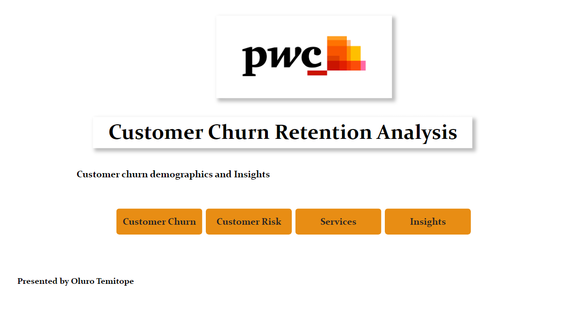
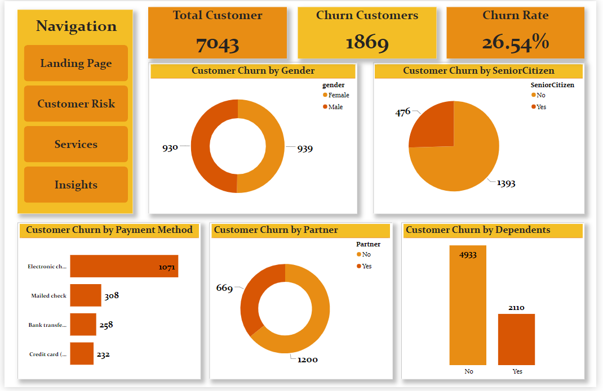
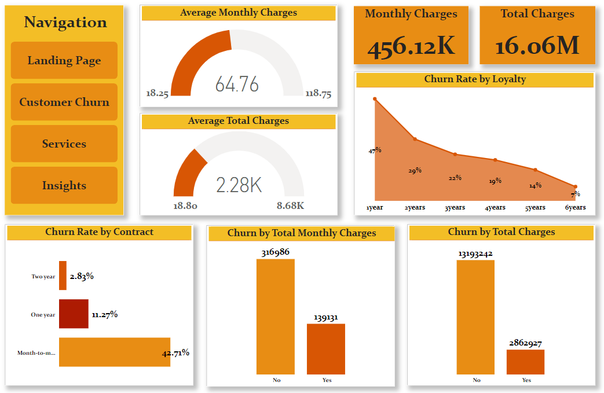
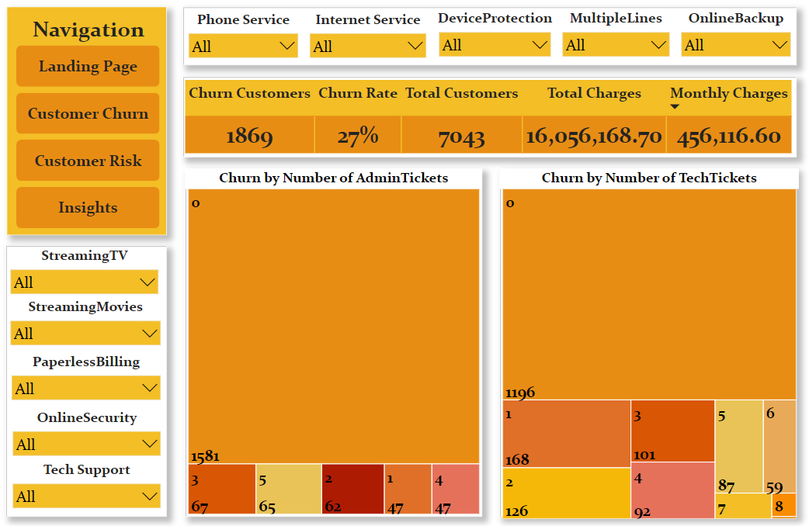

# Exploratory Analysis of Customer Churn in a Telecom Company
## Overview
This dataset contains all relevant customer data collected over the specified period. The data covers a range of variables such as customer ID, demogrphics, usage metrics and transaction history. It provides information about customers who have canceled their subscription, stopped using the service or made no purchases within a specific time.
## Aim
It aims to understand customer behavior to predict customers and develop focused customer retention programs. It aims to help the business make informed decisions and take proactive measures to reduce churn, enhance customer satisfaction and drive sustainability.
## Ojective
The objectives of this analysis are:
1. Understanding churn rate: Determining the rate at which customers are leaving the business.
2. Identifying Patterns: Identifying patterns and trends in customer behavior leading to churn.
3. Segmentation: Segment customers based on their sociodemography to understand which segments are prone to churn.
4. Retention Strategies: Formulating targeted retention strategies to minimize churn and maximize customer loyalty.

## Dataset Introduction
**Data Source** : https://www.kaggle.com/datasets/blastchar/telco-customer-churn

The data contains one **Fact table** and two **Dimension tables**. 

The fact table called **02 Churn Dataset** contains 7043 rows (customers) and 20 columns (features). 
The first dimension table called **Churn** contains 8 rows and 3 columns. 
The second dimension table called **Customer Information** contains 5 columns and 16 rows.

Each row represents a customer, each column contains customer’s attributes described on the column Metadata below.

* Customer ID - Unique customer ID

* Tenure - The number of months the customer has stayed with the company

* Loyalty - The number of years the customer has stayed with the company

* PhoneService - Whether the customer has a phone service or not (Yes, No)

* MultipleLines - Whether the customer has multiple lines or not (Yes, No, No phone service)

* InternetService - Customer’s internet service provider (DSL, Fiber optic, No)

* OnlineSecurity - Whether the customer has online security or not (Yes, No, No internet service)

* OnlineBackup - Whether the customer has online backup or not (Yes, No, No internet service)

* DeviceProtection - Whether the customer has device protection or not (Yes, No, No internet service)

* TechSupport - Whether the customer has tech support or not (Yes, No, No internet service)

* StreamingTv - Whether the customer has streaming TV or not (Yes, No, No internet service)

* StreamingMovies - Whether the customer has streaming movies or not (Yes, No, No internet service)

* Contract - The contract term of the customer (Month-to-month, One year, Two year)

* PaperlessBilling - Whether the customer has paperless billing or not (Yes, No)

* MonthlyCharges - The amount charged to the customer monthly

* TotalCharges - The total amount charged to the customer

* numAdminTickets - The number of admin tickets the customer has

* numTechTickets  - The number of tech tickets the customer has

* Churn key - The primary key that connects the _Fact Table_ and the _Churn_ dimension table

* Customer Key - The primary key that connects the _Fact Table_ and the _Customer Information_ dimension table

* Churn - Whether the customer churned or not (Yes or No)

* Payment Method - The customer’s payment method (Electronic check, Mailed check, Bank transfer (automatic), Credit card (automatic))

* Gender - Whether the customer is a male or a female

* SeniorCitizen - Whether the customer is a senior citizen or not (Yes, No)

* Partner - Whether the customer has a partner or not (Yes, No)

* Dependents - Whether the customer has dependents or not (Yes, No)

## Methodology
* Data cleaning and Transformation
* Data Modelling
* Data Visualization   
## Data Analytics Tools
* Power Bi

## Data Visualization

## Insights
* Male customer, dependent customers, senior citizens and customers without partners are more likely to churn.

* There is a higher chance of churn from customers using Electronic Card (Automatic) payment.

* Customers will most likely churn after their month-to-month contract.

* Churn rate declines as loyalty increases.

## Conclusions
By leveraging the data-driven insights,
1. Stakeholders might think about developing new services or expanding existing ones to target female consumers, independent individuals, senior citizens, and single or unmarried individuals.
2. The stakeholders could consider an all-inclusive package such as complimentary tickets and services for customers within 1-3years of loyalty to retain and convert them to long term customers.
3. To lower the rate of attrition beyond the initial contract, a financial incentive scheme with discounts or bonuses could be created for returning clients on month-to-month contracts.
4. The company must ascertain the reasons behind the high churn rate of electronic card payments and explore potential solutions.

